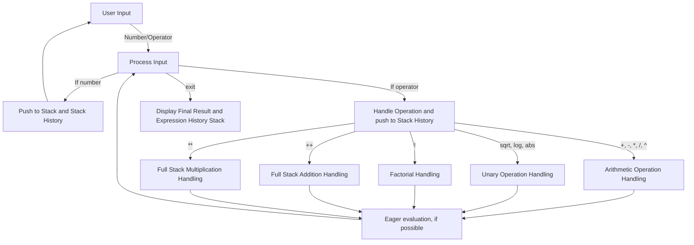

# RPN Calculator Documentation

## Overview

This document provides an overview of the RPN (Reverse Polish Notation) calculator implementation. The calculator allows users to input numbers and operators sequentially, and it evaluates the expression using an internal stack mechanism. In addition to basic arithmetic operations, it supports functions such as:

- Square root (`sqrt`)
- Logarithm base 10 (`log`)
- Absolute value (`abs`)
- Factorial (`!`)
- Full-stack addition (`++`)
- Full-stack multiplication (`**`)

It also supports the reconstruction of the entered expression in both standard infix notation and LaTeX formatting.

---

## Structure

The core component of the calculator is the `RPNCalculator` struct, which contains:

- **stack**: A vector (`Vec<f64>`) that holds the numerical values.
- **history_stack**: A vector (`Vec<String>`) that records the sequence of user inputs (both numbers and operators) to later reconstruct the original expression.

The struct derives the `Clone` trait, which enables the entire object to be cloned when needed (for example, to reconstruct a LaTeX expression without altering the original history).

---

## Function Interaction Diagram

---

## Function Descriptions

### `main()`

- **Purpose:**  
  Acts as the entry point of the application.

- **Functionality:**  
  - Initializes a new `RPNCalculator` instance.
  - Displays a welcome prompt.
  - Reads user input in a loop.
  - Processes each token by calling `apply_operation()`.
  - On receiving the token `"exit"`, it terminates the loop.
  - Before exiting, it prints:
    - The final evaluation result.
    - The reconstructed infix expression.
    - The LaTeX-formatted expression.

### `RPNCalculator::new()`

- **Purpose:**  
  Constructs and initializes a new calculator instance.

- **Functionality:**  
  - Creates empty vectors for both `stack` and `history_stack`.

### `RPNCalculator::apply_operation(&mut self, token: &str)`

- **Purpose:**  
  Routes the user input to the appropriate operation handler based on the token type.

- **Functionality:**  
  - Adds the token (converted to a `String`) to the `history_stack`.
  - Matches the token to determine the operation:
    - Basic arithmetic operators (`+`, `-`, `*`, `/`, `^`) are processed by `arithmetical_operation_handling()`.
    - Unary operations (`sqrt`, `log`, `abs`) are processed by `log_abs_sqrt_operation_handling()`.
    - Factorial (`!`) is processed by `factorial_operation_handling()`.
    - Full-stack operations (`++` and `**`) have dedicated handling methods.
    - If the token does not match any operator, it is treated as a number and passed to `new_number_handling()`.

### `RPNCalculator::arithmetical_operation_handling(&mut self, token: &str)`

- **Purpose:**  
  Processes binary arithmetic operations.

- **Functionality:**  
  - Pops the last two numbers from the `stack`.
  - Computes the result based on the provided operator.
  - Pushes the result back onto the `stack`.

### `RPNCalculator::log_abs_sqrt_operation_handling(&mut self, token: &str)`

- **Purpose:**  
  Handles unary operations like square root, logarithm, and absolute value.

- **Functionality:**  
  - Pops one number from the `stack`.
  - Computes the result using the corresponding mathematical function.
  - Pushes the result back onto the `stack`.

### `RPNCalculator::factorial_operation_handling(&mut self)`

- **Purpose:**  
  Calculates the factorial of the number at the top of the `stack`.

- **Functionality:**  
  - Pops one number from the `stack`.
  - Computes the factorial (using an iterator over the range `1..=n`).
  - Pushes the computed factorial (converted to `f64`) back onto the `stack`.

### `RPNCalculator::full_stack_addition_handling(&mut self)`

- **Purpose:**  
  Computes the sum of all the numbers in the `stack`.

- **Functionality:**  
  - Uses an iterator to sum all values in the `stack`.
  - Clears the `stack` and then pushes the sum back.

### `RPNCalculator::full_stack_multiplication_handling(&mut self)`

- **Purpose:**  
  Computes the product of all the numbers in the `stack`.

- **Functionality:**  
  - Uses an iterator to compute the product.
  - Clears the `stack` and then pushes the product back.

### `RPNCalculator::new_number_handling(&mut self, token: &str)`

- **Purpose:**  
  Processes tokens that represent numbers.

- **Functionality:**  
  - Attempts to parse the token as an `f64`.
  - If successful, pushes the number onto the `stack`.

### `RPNCalculator::welcome_prompt()`

- **Purpose:**  
  Displays a welcome message and usage instructions to the user.

- **Functionality:**  
  - Prints a multi-line message explaining how to use the calculator and how to exit.

### `RPNCalculator::get_result(&self) -> Option<f64>`

- **Purpose:**  
  Retrieves the final result of the computation.

- **Functionality:**  
  - Returns the last element from the `stack` (if any) as an `Option<f64>`.

### `RPNCalculator::reconstruct_expression_infix(&mut self) -> String`

- **Purpose:**  
  Recursively reconstructs the original expression in standard infix notation.

- **Functionality:**  
  - Pops tokens from `history_stack` and rebuilds the expression using proper parenthesis.
  - Supports both binary operators and full-stack operators (`++`, `**`) recursively.

### `RPNCalculator::reconstruct_expression_latex(&mut self) -> String`

- **Purpose:**  
  Recursively reconstructs the original expression in LaTeX format.

- **Functionality:**  
  - Similar in structure to the infix reconstruction, but formats the output using LaTeX syntax.
  - For example:
    - Addition and subtraction are formatted as `{left operator right}`.
    - Multiplication uses `\cdot` (e.g., `{left \cdot right}`).
    - Division uses `\frac{left}{right}`.
    - Exponentiation is formatted with superscripts (e.g., `{base^{exponent}}`).
  - Each sub-expression is grouped properly with curly braces to ensure correct LaTeX rendering.

---

## Function Interaction Diagram

