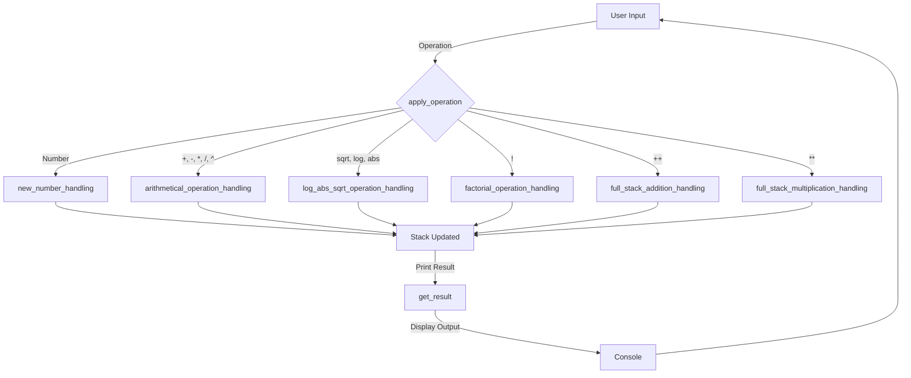

# Modern programming concepts – Team Rust

## Reverse Polish Notation (RPN) Calculator Documentation

### Overview
This Rust-based Reverse Polish Notation (RPN) calculator supports basic arithmetic operations, factorial calculations, logarithms, and full-stack operations like addition and multiplication. It also provides a LaTeX-compatible history of calculations.

### Features
- **Basic Arithmetic**: Addition (`+`), Subtraction (`-`), Multiplication (`*`), Division (`/`), and Exponentiation (`^`).
- **Advanced Functions**: Square root (`sqrt`), Logarithm base 10 (`log`), Absolute value (`abs`), and Factorial (`!`).
- **Full-stack Operations**: Addition of all stack elements (`++`), Multiplication of all stack elements (`**`).
- **Stack Handling**: Supports manual input processing and maintains calculation history.
- **LaTeX Output**: Converts expressions into LaTeX-compatible format for easy rendering.

---

### Class: `RPNCalculator`

#### Attributes
- `stack: Vec<f64>`: Stores numbers for operations.
- `latex_stack_history: String`: Maintains LaTeX-formatted history.
- `stack_history: String`: Stores infix notation history.
- `indicator: bool`: Helps initialize stack history.

#### Methods

##### `new() -> Self`
Initializes a new `RPNCalculator` instance with an empty stack and histories.

##### `apply_operation(&mut self, token: &str)`
Processes user input and determines the appropriate operation.
- Calls `arithmetical_operation_handling` for basic math operators.
- Calls `log_abs_sqrt_operation_handling` for sqrt, log, and abs.
- Calls `factorial_operation_handling` for factorial calculations.
- Calls `full_stack_addition_handling` and `full_stack_multiplication_handling` for full-stack operations.
- Calls `new_number_handling` if input is a number.

##### `arithmetical_operation_handling(&mut self, token: &str)`
Handles binary arithmetic operations (`+`, `-`, `*`, `/`, `^`).
- Pops two values from the stack and applies the operation.
- Updates `stack_history` and `latex_stack_history`.
- Pushes the result back onto the stack.

##### `log_abs_sqrt_operation_handling(&mut self, token: &str)`
Handles square root, logarithm, and absolute value operations.
- Pops a value from the stack, applies the function, and pushes the result back.
- Updates `stack_history` and `latex_stack_history` accordingly.

##### `factorial_operation_handling(&mut self)`
Computes the factorial of the last number in the stack.
- Pops a value, computes its factorial, and pushes the result.
- Updates `stack_history` and `latex_stack_history`.

##### `full_stack_addition_handling(&mut self)`
Adds all numbers in the stack.
- Iterates over the stack, updating `stack_history` and `latex_stack_history`.
- Clears the stack and pushes the sum.

##### `full_stack_multiplication_handling(&mut self)`
Multiplies all numbers in the stack.
- Iterates over the stack, updating `stack_history` and `latex_stack_history`.
- Clears the stack and pushes the product.

##### `new_number_handling(&mut self, token: &str)`
Parses a number from the input and pushes it onto the stack.

##### `welcome_prompt()`
Displays a welcome message when the calculator starts.

##### `get_result(&self) -> Option<f64>`
Returns the last computed result from the stack.

##### `main()`
Handles user input and calls appropriate methods to process operations.

---

### Interaction Flow (Mermaid 10.0.2 Diagram)



---

### Usage Example
#### Input:
```
1
2
+
3
*
exit
```
#### Output:
```
The current result is: 3
The current result is: 9
Exiting RPN Calculator...
Your infix calculation is: ((1 + 2) * 3)
Your LaTeX calculation is: {{1} + 2} \cdot 3
The final result is: 9
```

